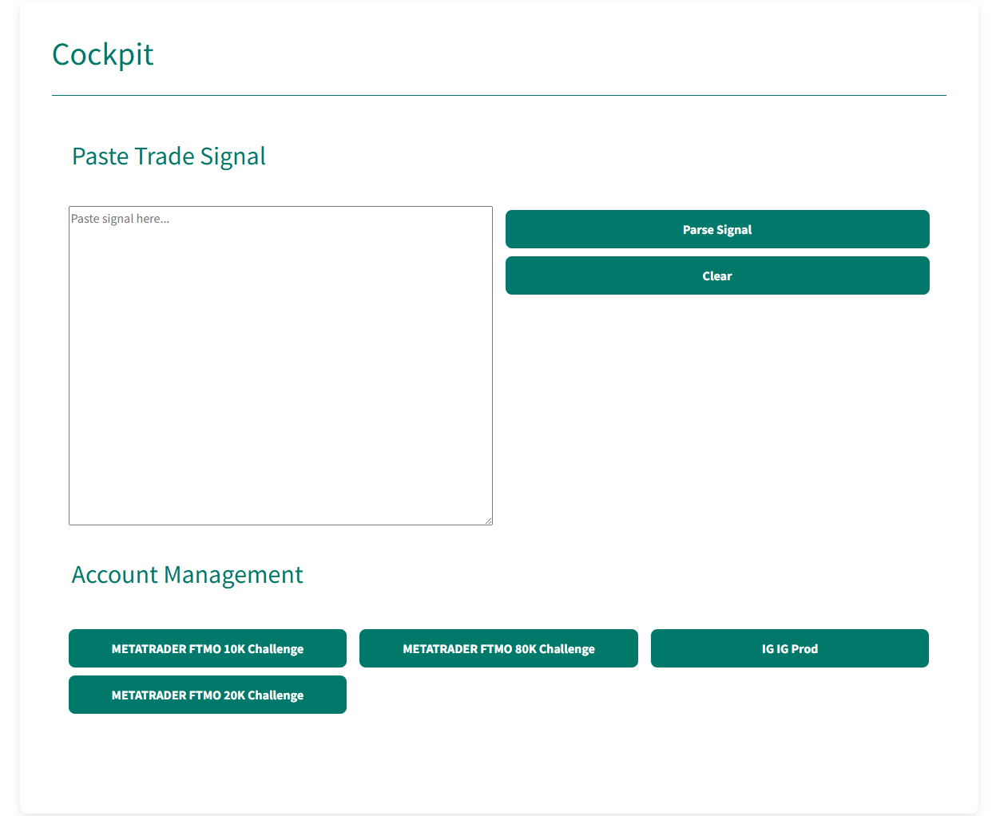
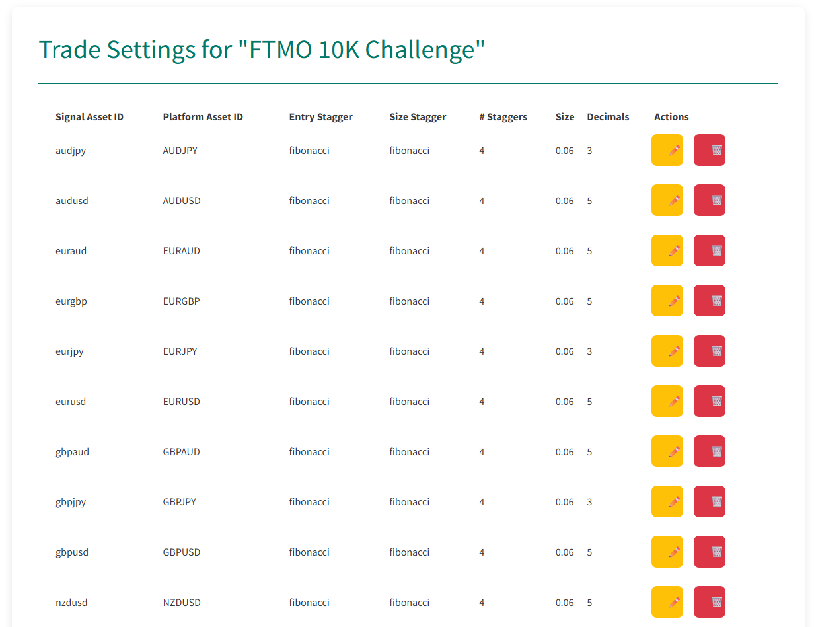

# Alpha-Rai

## Project Overview

Alpha-Rai is a dash based trading bot (manually as of version 0.0.5) that parses signals from
TradingView to place trades on MetaTrader5.
It is still a work in progress, but trading is already possible.
The project will be free and open source, only commercial use is prohibited.

## How it works

The following image shows the cockpit of the Alpha-Rai bot. 

Paste your signal into the input field and press the "Parse Signal" button.
The bot will parse the signal and display the parsed data in the output field.
A new button will appear to place the trade.
Press the "Place Trade" button to place the trade on all configured MetaTrader5 accounts with individual account settings.

All accounts can be uniquely configured with different settings. 

## Roadmap

The project is still in its early stages, but the following features are planned for future releases:
- **Signal Parsing**: The bot can subscribe to an SNS topic and parse signals directly from AWS.
- **Automatic Local Strategy**: The bot can execute trades based on local strategies. Let your PC run and earn! :)
- **Analytics**: The bot can analyze the performance of trades and provide insights into the trading strategy. For now it's only preliminary, but the analysis tab will be improved in the future.
- **Backtesting**: The bot will supports backtesting of strategies and signals.

## Community

Join our Discord community to discuss the project, share ideas, and get support from other users and developers.  

## Donate

The signals, alerts, charting data, AWS infrastructure, and other resources are not free.
Currently the project is funded by the developer, but donations are welcome to help cover the costs.

