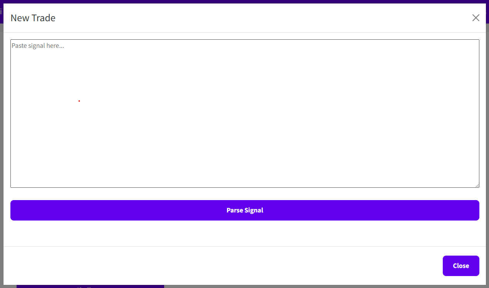
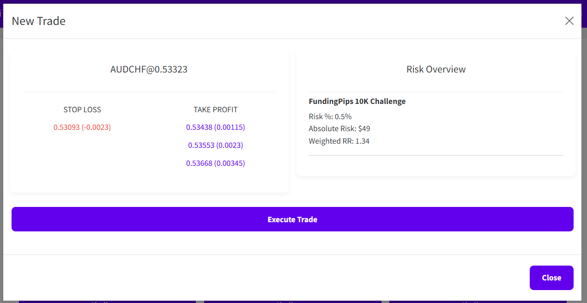
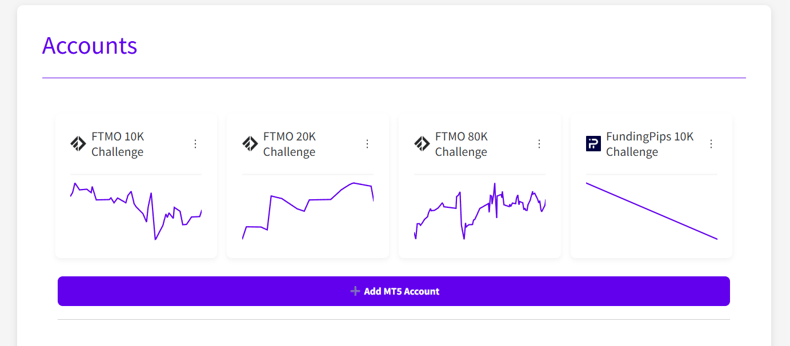
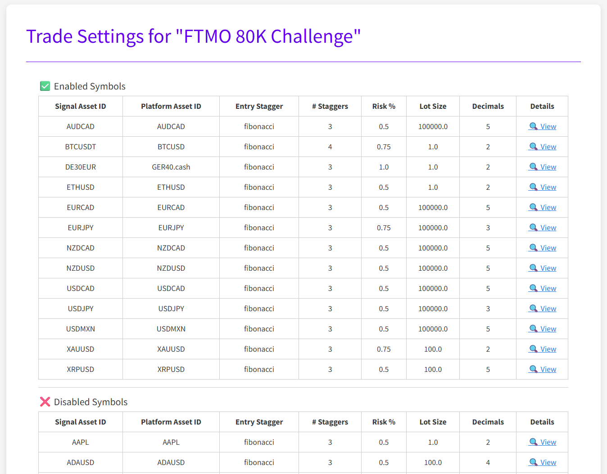

# Alpha-Rai

## Disclaimer

Trading involves substantial risk and is not suitable for everyone.
Past performance does not guarantee future results.
You are solely responsible for any trades placed by using this application.
Use it at your own risk.
The developer assumes no liability for financial losses or damages resulting from the use of this tool.

## Project Overview

Alpha-Rai is a dash based trading application that parses signals from TradingView and
places trades on multiple MetaTrader5 accounts simultaneously.
Currently, it is still work in progress, but placing of trades are already working, as well as, trading automatically
with a discord bot. (Contact me on Discord for more information.)
The project will be free and open source, only commercial use is prohibited.

## How it works

Currently, it is still required to have an active Amazon Web Services (AWS) account to store the secrets for the accounts.
In the future this is planned to be removed and it should be possible to run the bot completely locally.

Currently, there are two ways to place trades:

* **Manual Trading**: You can manually parse signals from TradingView and place trades on multiple accounts.
* **Automatic Trading**: You can use a Discord bot to place trades automatically based on signals on our Discord Channel.

The following image shows the cockpit of the Alpha-Rai bot. 

Paste your signal into the input field and press the "Parse Signal" button.
The bot will parse the signal and display the parsed data in the output field.
A new button will appear to place the trade.
Press the "Place Trade" button to place the trade on all configured MetaTrader5 accounts with individual account settings. 

You can configure the accounts in the account section. Currently, trading has been tested with FTMO and FundingPips accounts,
but it should work with any MetaTrader5 account. 

All accounts can be uniquely configured with different settings. 

## Roadmap

The project is still in its early stages, but the following features are planned for future releases:
- **Confluences**: Add support for confluences to filter signals based on multiple indicators or conditions.
- **Analytics**: Add support for analytics to track the performance of the trades and strategies.
- **Dynamic Positions**: Add support for dynamic positions based on analytics and confluences.

## Community

Join our Discord community to discuss the project, share ideas, and get support from other users and developers.  

## Contributions

Contributions are welcome!
If you have any ideas, suggestions, or bug reports, please open an issue on GitHub or chat with me on Discord.
For now, the project is still in its early stages, so there are no contribution guidelines yet as well as no code of conduct.

## Donate

The signals, alerts, charting data, AWS infrastructure, and other resources are not free.
Currently the project is funded by the developer, but donations are welcome to help cover the costs.

